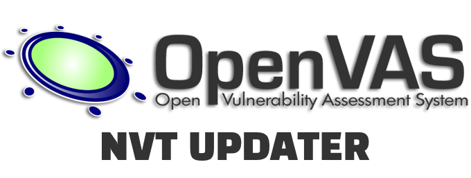

<h1 align=center> OpenVas NVT Updater </h1>

<h3 align=center> 



</h3>

Simple Bash script that can be used to update NVT cache in OpenVas Vulnerability Scanner upon initial setup.

**Pre-Requisites**

```bash
sudo chmod +x OpenVas_NVTUpdater.sh
```

`OpenVas_NVTUpdater.sh` script details (might need to be edited based on install location):

 ```bash
 #!/bin/bash
export FEED=feed.community.greenbone.net
export COMMUNITY_NVT_RSYNC_FEED=rsync://$FEED:/nvt-feed
export COMMUNITY_CERT_RSYNC_FEED=rsync://$FEED:/cert-data
export COMMUNITY_SCAP_RSYNC_FEED=rsync://$FEED:/scap-data

/usr/local/sbin/greenbone-nvt-sync
/usr/local/sbin/openvasmd --rebuild --progress
/usr/local/sbin/greenbone-certdata-sync
/usr/local/sbin/greenbone-scapdata-sync
/usr/local/sbin/openvasmd --update --verbose --progress
/etc/init.d/openvas-manager restart
/etc/init.d/openvas-scanner restart
 ```
